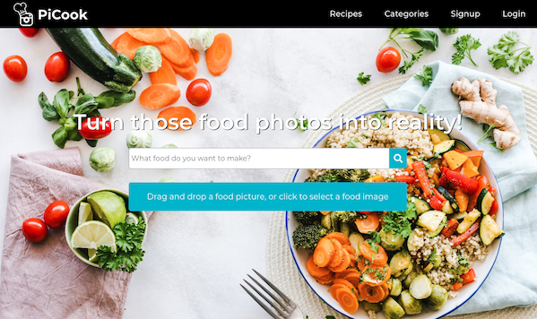

# PiCook
[Live Site!](https://picook.herokuapp.com/#/)

PiCook is an app where you can find recipes by uploading a picture or searching a title of the meal or an ingredient.
If you haven't sign up an account with us, you can still search for recipes, but you are not allowed to create/edit/delete your own recipes.

## Features:
### User Auth:
 * Create a new User
 * Login to existing account
 * Logout current User

### Search by Text:
 * Redirect to the recipes index page after searching for a food
 * Render a list of recipes from The Meals DB API
 * Each image of a recipe is a link to the details of that recipe
 

### Search by Image:
* Redirect to Index page after uploading an image of food
* Render a list of options that the image can be using Image

### User Recipe:
 * Save a recipe
   * Title and instructions are pre-filled when the user is trying to save the fetched recipe 
 * Edit a recipe
   * Previous information is pre-filled 
 * Delete a recipe

### Future Goals:
* User Recipe:
 * User saves their own recipes / private
 * Favorite a recipe
 * Rate a recipe
 * Upload a picture when saving their own recipe
 * User can organize different recipes by categories.